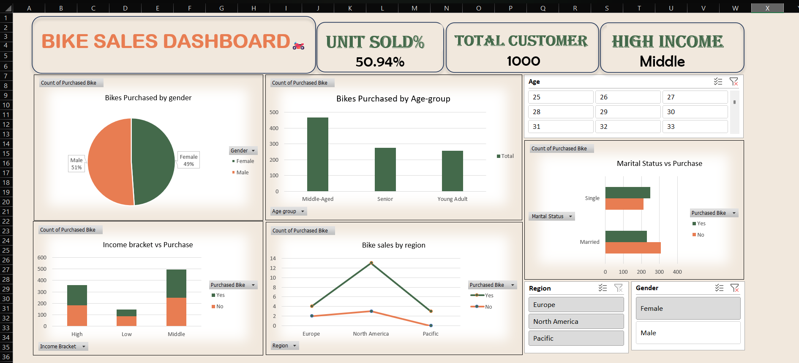

🚴‍♂️ Bike Dekho Sales Dashboard — Excel-Based EDA Project
"Excel might not be fancy, but when used right, it becomes a storyteller."

Welcome to my end-to-end Excel EDA and Dashboarding project on bike sales, where raw data meets meaningful insights.

📌 Project Overview
This project explores sales data from a fictional bike company — Bike Dekho — using Microsoft Excel for:
Data cleaning
KPI generation
Pivot-based analysis
Visual storytelling via dashboards

🧹 Data Cleaning Highlights
Categorized Age Groups into ranges (e.g., 18–25, 26–35, etc.)
Created Income Brackets for better segmentation
Resolved inconsistencies in Yes/No responses
Removed nulls and duplicate records

📊 Key KPIs Tracked
KPI	Description
Total Sales	Count of all bikes sold
Units Sold	Total number of 'Yes' responses
Average Income	Average income of bike purchasers
Customer Count	Total unique customer entries

📈 Insights Discovered
🔹 Customers in higher income brackets were significantly more likely to purchase a bike
🔹 Strong correlation between income level and purchasing behavior
🔹 Clean dashboards reveal patterns hidden in messy datasets

💻 Tools & Features Used
Microsoft Excel
Pivot Tables
GETPIVOTDATA functions
Conditional Formatting
Custom KPI Cards
Charts and Dashboard Design

📷 Dashboard Preview

🔗 Connect with Me
📫 LinkedIn: [Your LinkedIn Profile](https://www.linkedin.com/in/kashish-chaudhary-286aa1290/)

